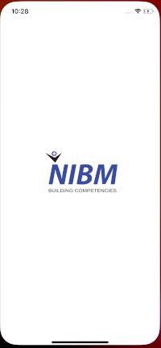
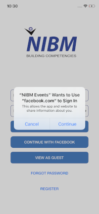
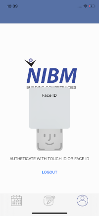
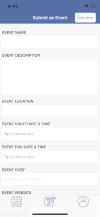

# iOS Application Development

### BSc (Hons) in Computing
18.2

301CEM - IOS Application Development

Course Work-1

SID : 9256224

NIBM ID: COBSCCOMP182P-030

## Screenshots

## References
### Alert
- [How To: Displaying Alerts With UIAlertController In Swift](https://learnappmaking.com/uialertcontroller-alerts-swift-how-to/)
- [UIAlertController in Swift](https://medium.com/swift-india/uialertcontroller-in-swift-22f3c5b1dd68)

### Colors
-[How to use Named Color in Xcode 9](https://medium.com/bobo-shone/how-to-use-named-color-in-xcode-9-d7149d270a16)

### Facebook SDK
-[Facebook Login for iOS - Quickstart](https://developers.facebook.com/docs/facebook-login/ios)
-[Facebook iOS SDK](https://github.com/facebook/facebook-ios-sdk)
-[Facebook User Graph Reference](https://developers.facebook.com/docs/graph-api/reference/user/)

### Firebase
- [Get Started with Firebase Authentication on iOS](https://firebase.google.com/docs/auth/ios/start)
- [Create a Storage Reference on iOS](https://firebase.google.com/docs/storage/ios/create-reference)
- [Firebase Cloud Messaging](https://firebase.google.com/docs/cloud-messaging)

### Sensors
- [Working with Touch ID API in iOS 8 SDK](https://www.appcoda.com/touch-id-api-ios8/)

### Storyboard and View Controller
- [How To Set Application Root View Controller Programmatically In Xcode 11](https://www.dev2qa.com/how-to-set-application-root-view-controller-programmatically-in-xcode-11/)
- [set initial viewcontroller in appdelegate - swift](https://stackoverflow.com/questions/26753925/set-initial-viewcontroller-in-appdelegate-swift)
- [How to replace the `rootViewController` of the `UIWindow` in iOS](https://qnoid.com/2019/02/15/How_to_replace_the_-rootViewController-_of_the_-UIWindow-_in_iOS.html)
- [How to load a different storyboard depending on screen size in iOS](https://pinkstone.co.uk/how-to-load-a-different-storyboard-depending-on-screen-size-in-ios/)
- [How to segue between ViewControllers with different storyboards](https://medium.com/@wilson.balderrama/how-to-segue-between-storyboards-86c582f976f7)
- [iOS Navigation Controller Tutorial](https://www.youtube.com/watch?v=unaf817uNtQ)

### UIView
- [Converting UIColor to CGColor in swift](https://stackoverflow.com/questions/27821785/converting-uicolor-to-cgcolor-in-swift)
- [How to use Named Color in Xcode 9](https://medium.com/bobo-shone/how-to-use-named-color-in-xcode-9-d7149d270a16)
- [Add a button on right view of UItextfield in such way that, text should not overlap the button](https://stackoverflow.com/questions/42082339/add-a-button-on-right-view-of-uitextfield-in-such-way-that-text-should-not-over)

### UIImagePickerController
- [Picking images with UIImagePickerController in Swift 5](https://theswiftdev.com/picking-images-with-uiimagepickercontroller-in-swift-5/)
- [Choosing Images with UIImagePickerController in Swift
](https://www.codingexplorer.com/choosing-images-with-uiimagepickercontroller-in-swift/)

